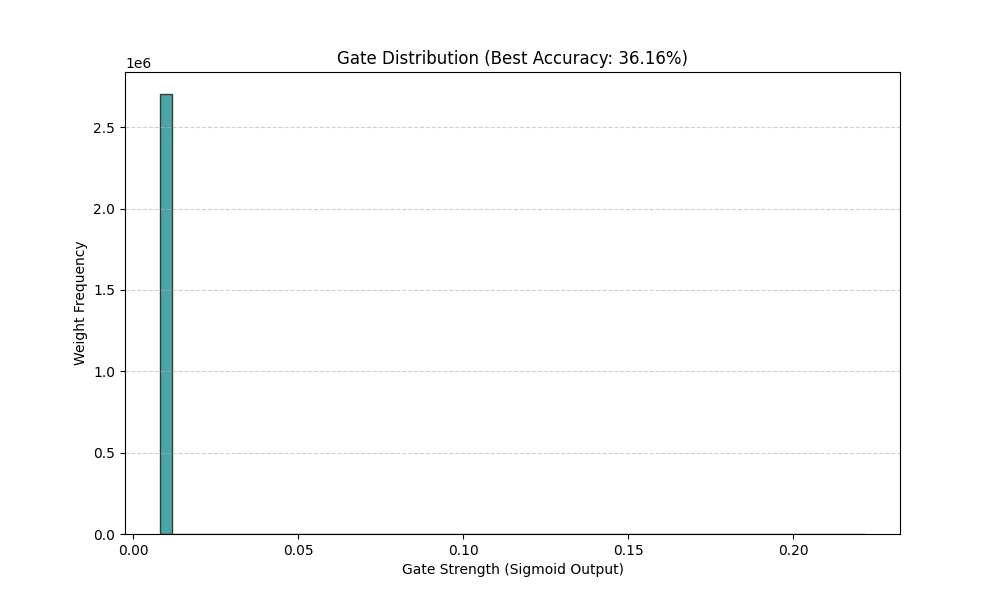

# Dynamic Compression: Self-Pruning Neural Network (CIFAR-10)

This repository demonstrates a dynamic pruning approach to neural network optimization. Unlike traditional static pruning, this model uses learnable gating mechanisms to identify and suppress redundant parameters during training.

## Project Philosophy

Deep learning models are often over-parameterized. This project implements a "survival of the fittest" connection strategy, where every weight must justify its existence through its contribution to classification accuracy.

Connections that fail to provide enough signal are pushed toward zero by an L1-driven gating penalty.

## Technical Architecture

- **Four-layer MLP:** A 3072-768-384-128-10 architecture for CIFAR-10 classification.
- **Leaky ReLU activation:** Helps maintain stable gradient flow during aggressive pruning.
- **Custom pruning gates:** Every weight `W` is transformed into `W' = W * sigmoid(g)`, where `g` is a learnable gate parameter.
- **Hyperparameter sensitivity:** The experiment compares different lambda values to explore the sparsity/accuracy trade-off.

## Performance and Compression Results

The following table summarizes the trade-off between accuracy and extreme compression:

| Lambda | Test Accuracy | Sparsity Level | Compression Ratio |
| --- | ---: | ---: | ---: |
| 0.01 | 36.16% | 99.96% | ~2500:1 |
| 0.05 | 32.73% | 99.98% | ~5000:1 |
| 0.10 | 31.25% | 99.99% | ~10000:1 |

Even at 99.99% sparsity, the model maintains accuracy well above random guessing for CIFAR-10, showing that the pruning mechanism preserves a compact set of useful feature extractors.



## The Mathematics of Sparsity

The pruning behavior is governed by an L1 regularization penalty on the sigmoid gates. This creates constant downward pressure on connection strength.

- **Rent analogy:** Each connection pays a penalty to stay active.
- **Automatic selection:** If a connection does not reduce classification error enough to offset its penalty, the optimizer drives its gate toward zero.
- **Thresholding:** A strict threshold of `1e-2` determines the final pruned state.

## Setup and Usage

### 1. Create a virtual environment

```bash
python -m venv venv
```

Activate it:

```bash
# macOS/Linux
source venv/bin/activate

# Windows PowerShell
.\venv\Scripts\Activate.ps1
```

### 2. Install dependencies

```bash
pip install torch torchvision matplotlib numpy
```

### 3. Prepare CIFAR-10

The script currently loads CIFAR-10 with `download=False`, so the dataset must already exist under `./data`.

If you want PyTorch to download the dataset automatically, change both CIFAR-10 dataset calls in `self_pruning_nn.py` from:

```python
download=False
```

to:

```python
download=True
```

### 4. Run the experiment

```bash
python self_pruning_nn.py
```

The script trains three models with different lambda values, prints a comparison table, and writes the gate histogram to `sparsity_distribution.png`.

## Author

Naman Mahajan

## Implementation

PyTorch / CIFAR-10 case study
